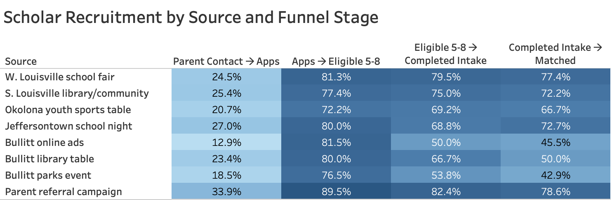
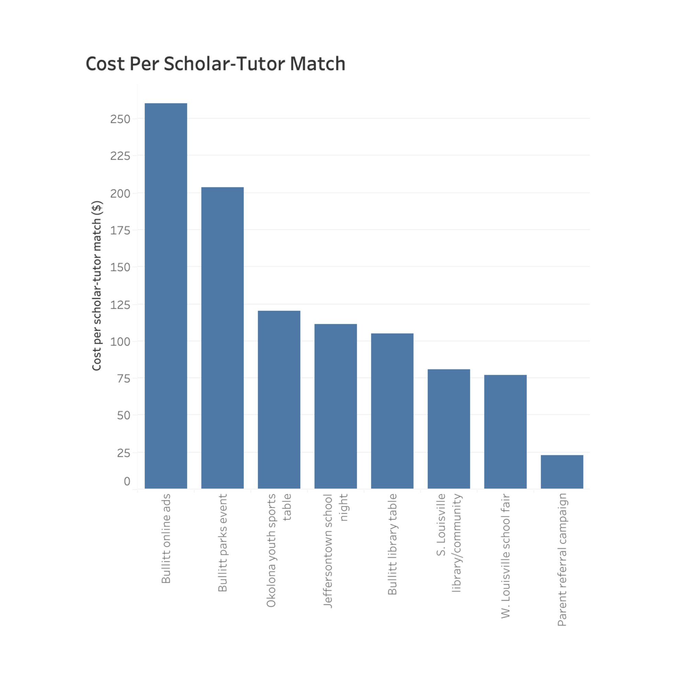
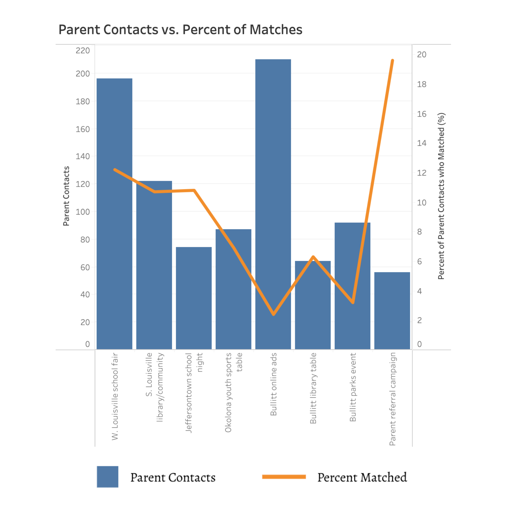

# Educational Nonprofit Recruitment Analysis
Analyzed recruitment data for a local education nonprofit to identify the most effective outreach strategies, evaluate conversion and retention trends, and recommend data-driven expansion into neighboring counties through targeted community partnerships and resource allocation.
## Business Problem

A local educational nonprofit wanted to identify which recruitment strategies generated the strongest results, evaluate outreach effectiveness, and determine where to focus future expansion efforts.
## Tools

- SQL
- Excel
- Tableau

## Project Objectives

- Evaluate the effectiveness of existing recruitment channels.
- Compare conversion and retention across outreach strategies.
- Identify opportunities for expansion into neighboring counties.
- Provide data-driven recommendations to improve recruitment outcomes.
 
## Key Findings

- Parent referral campaigns generated the highest conversion rates and lowest cost per successful match.
- Paid online advertising produced the lowest return on investment.
- Community-based outreach efforts demonstrated stronger long-term engagement.
- Expansion efforts should prioritize high-performing outreach channels before increasing advertising spend.

## Business Recommendations

- Expand successful parent referral initiatives into neighboring communities.
- Increase investment in community partnerships with schools and local organizations.
- Reduce spending on low-performing paid advertising campaigns.
- Continue monitoring recruitment performance to guide future outreach decisions.

## Repository Contents

- `README.md` – Project overview, objectives, findings, and recommendations.
- `sql/` – SQL queries used to explore and analyze the data.
- `images/` – Visualizations and dashboard screenshots.
- `report/` – Final business report (anonymized).

## Skills Demonstrated

- Business problem solving
- SQL querying
- Data exploration
- Recruitment funnel analysis
- Data visualization
- Strategic recommendations

## Visualizations
### Recruitment Funnel Heatmap
This heatmap visualizes conversion rates across the recruitment funnel by outreach source, highlighting where prospective scholars were most likely to progress and where the greatest attrition occurred.

### Cost per Successful Scholar Match

This visualization compares the cost per successful scholar match across recruitment channels, helping identify which outreach strategies delivered the greatest return on investment and where recruitment resources could be allocated more effectively.

### Parent Contacts vs. Percent of Scholar Matches

This comparison highlights the relationship between initial parent outreach and successful scholar matches by recruitment source. It demonstrates that higher outreach volume did not necessarily translate into more scholar matches, reinforcing the importance of prioritizing high-converting recruitment channels over simply increasing outreach.

